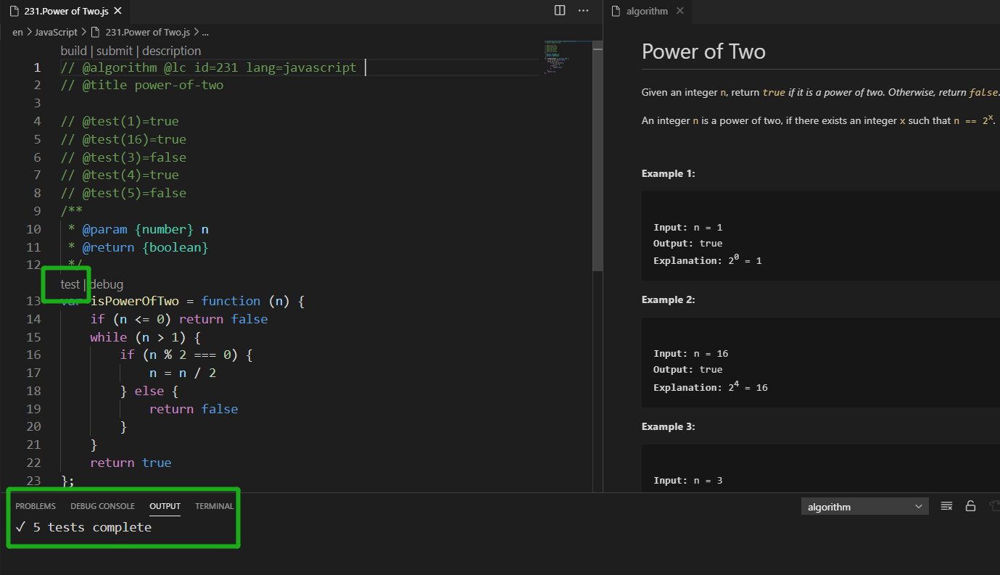
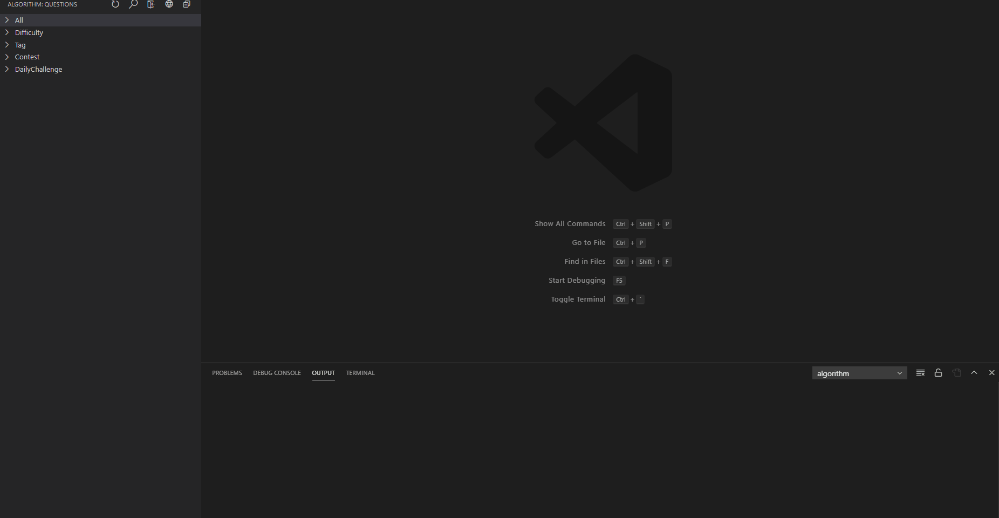

# Inline Test for AI：面向 AI 的注释行内测试规范

## 1. 目的

本文档定义一种面向 AI 和自动化工具的行内测试注释规范，用于在函数、方法或规则定义附近提供可解析的真实输入输出样例。该规范的主要目标，是让行为信息紧邻实现，以提升代码理解、检索、摘要生成、变更分析和样例提取的准确度。

在此基础上，Inline Test 还具有以下附加收益：

- 可作为自动化测试的样例来源，尤其适用于单元测试场景，包括 AI 驱动的测试生成与执行。
- 可支持 AI 采用分层读取策略，先读取函数名、函数描述和真实用例，在多数理解场景下减少对具体实现的展开，从而降低上下文消耗。
- 可作为 IDE 插件的输入基础，用于快速执行测试和按单条样例启动调试；但在 AI Coding 时代，这一能力更适合作为面向人工编码的辅助收益，而不是本规范的主要目标。

## 2. 基本定义

Inline Test 是紧邻实现的结构化注释测试，包含输入参数列表和输出结果。

Inline Test 应满足以下要求：

- 紧邻目标符号定义。
- 包含真实输入参数列表和真实输出。
- 采用固定语法。
- 允许脚本和 Agent 稳定提取。

## 3. 快速示例

### 3.1 TypeScript 单参数

```ts
// @test(1)=true
// @test(16)=true
// @test(3)=false
function isPowerOfTwo(n: number): boolean {
  if (n <= 0) return false;
  while (n > 1) {
    if (n % 2 === 0) {
      n = n / 2;
    } else {
      return false;
    }
  }
  return true;
}
```

### 3.2 TypeScript 多参数

```ts
// 给定一种规律 pattern 和一个字符串 s，判断 s 是否遵循相同的规律。
// @test("abba","dog cat cat dog")=true
// @test("abba","dog cat cat fish")=false
// @test("aaaa","dog cat cat dog")=false
function wordPattern(pattern: string, s: string): boolean {
  const word2ch = new Map();
  const ch2word = new Map();
  const words = s.split(' ');
  if (pattern.length !== words.length) {
    return false;
  }
  for (const [i, word] of words.entries()) {
    const ch = pattern[i];
    if (word2ch.has(word) && word2ch.get(word) != ch || ch2word.has(ch) && ch2word.get(ch) !== word) {
      return false;
    }
    word2ch.set(word, ch);
    ch2word.set(ch, word);
  }
  return true;
}
```

### 3.3 Python

```python
# @test(1)=true
# @test(16)=true
# @test(3)=false
def is_power_of_two(n: int) -> bool:
    if n <= 0:
        return False
    while n > 1:
        if n % 2 == 0:
            n = n // 2
        else:
            return False
    return True
```

## 4. 语法规范

单条 Inline Test 的规范形态如下：

```text
<comment-prefix> @test(<json-param-1>,<json-param-2>,...)=<output-json>
```

约束如下：

- `<comment-prefix>` 为所在语言的单行注释前缀，例如 `//`、`#`。
- 每个输入参数必须是 JSON 可表示字面量。
- 输出结果必须是 JSON 可表示字面量。
- 多个输入参数按顶层逗号分隔。
- `)` 与 `=` 之间、`=` 与输出结果之间不应插入空格。
- 一行只表达一个断言。

合法示例：

- `// @test(1)=true`
- `// @test("abba","dog cat cat dog")=true`
- `// @test({"size":10},"strict")={"ok":true}`
- `# @test([1,2,4])=false`

不推荐或无效示例：

- `// @test(1) = true`：`=` 两侧包含空格，不符合规范写法。
- `// @test(foo)=true`：`foo` 不是 JSON 可表示字面量。
- `// @test(1,true`：括号不闭合，无法稳定解析。
- `// @test(1)=ok`：`ok` 不是 JSON 可表示字面量。

## 5. 编写要求

### 5.1 输入与输出

- `@test(...)` 内的每一个参数都应使用 JSON 可表示字面量。
- `=` 右侧结果应使用 JSON 可表示字面量。
- 多参数函数使用参数列表，不使用单个聚合输入占位表达。

示例：

- `@test("abba","dog cat cat dog")=true`
- `@test(10,{"mode":"strict"})=false`
- `@test([1,2],3)=[1,2,3]`

### 5.2 位置

- Inline Test 必须紧邻函数、方法、规则或符号定义。
- `@test` 注释与目标符号之间不应插入无关注释或其他定义。

### 5.3 函数描述

为支持 AI 分层读取，建议在 Inline Test 上方或相邻位置补充简洁、稳定的函数描述。

推荐写法如下：

- 描述函数做什么，而不是描述作者如何实现。
- 优先说明输入约束、核心判断条件和输出语义。
- 使用与代码一致的领域词汇，避免口语化缩写和歧义表达。
- 尽量让描述与 `@test` 用例互相印证，而不是重复抄写样例值。

推荐示例：

- `// 给定一种规律 pattern 和一个字符串 s，判断 s 是否遵循相同的规律。`
- `// 判断整数 n 是否为 2 的幂。`
- `# 将输入数组按升序去重后返回。`

不推荐示例：

- `// 这个函数很重要。`：缺少明确行为语义。
- `// 这里用了两个 Map 来做。`：描述了实现细节，而不是函数行为。
- `// 处理一下输入。`：语义过于宽泛，无法支持稳定理解。

### 5.4 覆盖

- 至少覆盖一个正常路径样例。
- 至少覆盖一个边界或失败样例。
- 建议优先覆盖空值、零值、负值、默认值和非法输入。

### 5.5 边界

- Inline Test 是行为摘要层，不替代正式测试体系。
- Inline Test 可为自动化测试提供紧邻实现的样例来源，尤其适合作为单元测试生成、补全和校验的输入。
- Inline Test 有助于降低 AI 的上下文消耗，但前提是函数描述清晰、样例真实且覆盖基本路径；当样例不足或语义冲突时，仍需回退到具体实现。
- 不适用于强依赖外部系统、复杂上下文、异步协作或系统级验证场景。

## 6. 解析规则

解析目标是将连续的 `@test` 注释块与其后紧邻的目标符号绑定，并提取为结构化记录。

### 6.1 最小提取单位

最小提取单位为：

- 连续的 `@test` 注释块。
- 紧随其后的一个目标符号定义。

如果 `@test` 注释块与目标符号之间被其他定义或无关注释打断，则绑定失败。

### 6.2 解析步骤

1. 扫描源码中的单行注释。
2. 识别以 `@test(` 开始、包含闭合右括号 `)` 和结果分隔符 `=` 的注释行。
3. 收集连续出现的 `@test` 行，形成测试块。
4. 将测试块绑定到其后第一个有效的函数、方法、规则或符号定义。
5. 按括号配对规则截取 `@test(` 与对应右括号 `)` 之间的完整输入片段。
6. 按顶层逗号拆分输入片段，得到参数列表。
7. 将每个参数和输出结果分别按 JSON 值解析。
8. 产出结构化记录。

### 6.3 结构化输出

解析结果至少包含以下字段：

- `symbol`：目标符号名称。
- `file`：文件路径。
- `line`：符号定义行或测试块起始行。
- `language`：源文件语言。
- `inputs`：输入参数列表。
- `output`：输出结果。
- `raw`：原始注释文本。

示例：

```json
{
  "symbol": "wordPattern",
  "file": "pattern.ts",
  "line": 5,
  "language": "typescript",
  "tests": [
    {
      "inputs": ["abba", "dog cat cat dog"],
      "output": true,
      "raw": "// @test(\"abba\",\"dog cat cat dog\")=true"
    },
    {
      "inputs": ["abba", "dog cat cat fish"],
      "output": false,
      "raw": "// @test(\"abba\",\"dog cat cat fish\")=false"
    }
  ]
}
```

### 6.4 实现要求

- 不应只依赖单个宽松正则直接截取整行。
- 必须正确处理括号配对。
- 必须按顶层逗号拆分参数列表。
- 必须允许参数内部出现对象、数组、逗号、空格和嵌套结构。

必须正确处理的示例：

- `// @test([1,2,4])=true`
- `// @test({"size":10,"mode":"strict"},true)={"ok":true}`
- `// @test("a,b,c",",")=["a","b","c"]`
- `// @test("abba","dog cat cat dog")=true`

### 6.5 失败处理

出现以下情况时，解析器应返回无效样例，而不是自行猜测：

- 任一输入参数不是合法 JSON 可表示字面量。
- 输出不是合法 JSON 可表示字面量。
- `@test` 注释未绑定到明确目标符号。
- 同一测试块存在无法区分归属的多个定义。

失败记录应保留原始文本和错误原因。

## 7. Agent 使用方式

推荐采用分层读取策略，以兼顾理解准确度和上下文成本。

Agent 读取顺序如下：

1. 先读取符号名、签名、函数描述和绑定的 `@test` 列表。
2. 基于函数描述、参数列表和输出结果建立初步行为判断，形成函数的相对准确描述。
3. 如果任务仅涉及理解、检索、摘要、分类或粗粒度分析，可暂不展开完整函数体。
4. 仅在样例不足、行为存在冲突、需要精确判断、需要修改实现或需要定位缺陷时，再读取完整函数内容。

## 8. 适用范围

适用场景：

- 纯函数或近似纯函数。
- 输入输出关系明确的工具函数。
- 格式化、转换、归一化、判断类逻辑。

不适用场景：

- 强依赖数据库、网络、文件系统的逻辑。
- 需要复杂上下文、fixture 或 mock 的逻辑。
- 长流程编排、异步协作、系统级验证路径。

## 9. 落地要求

落地顺序如下：

1. 统一 `@test(...) = ...` 语法。
2. 统一输入参数和输出使用 JSON 可表示字面量。
3. 优先在工具函数和纯函数中试点。
4. 在代码评审中检查 Inline Test 是否同步更新。
5. 增加脚本校验，验证语法、绑定关系和可解析性。
6. 按需接入索引、检索和摘要流程。

## 10. 风险

- 语法不统一会直接降低可解析性。
- 样例过期会误导 Agent。
- 函数过长时，Inline Test 不能替代完整代码阅读。

## 11. IDE 集成扩展

Inline Test 还可以作为 IDE 插件的输入基础，用于提升人工编码时的测试和调试效率。不过在 AI Coding 时代，这一方向属于次要但实用的扩展收益，而不是本规范的主要目标。

以 VS Code 为例，可按如下方式集成：

1. 插件自动识别带有 Inline Test 的函数、方法或规则定义。
2. 在目标符号上方提供 `test` 和 `debug` 操作入口，例如 CodeLens、悬浮按钮或等价交互。
3. 点击 `test` 时，运行该符号绑定的全部测试用例，并将结果输出到 VS Code Output。
4. 选中某条测试用例后点击 `debug` 时，将该注释样例视为调试入口，提取对应参数并启动调试流程。
5. 调试过程中可将断点与测试注释建立映射关系，使用户能够准确定位到触发当前执行路径的具体样例。

这种扩展能力的价值在于：

- 让真实样例直接变成可执行的测试入口。
- 让注释中的单条用例可以成为精确调试入口。
- 降低从阅读样例到复现问题之间的切换成本。

示意如下：





如需增强人工编码体验，可在 IDE 插件中接入 `test` 和 `debug` 入口，将 Inline Test 转化为可执行的测试与调试动作。

## 12. 命名

推荐名称为 `Inline Test for AI`。

可接受的近义命名包括：

1. `AI-Friendly Inline Tests`
2. `面向 Agent 的 Inline Test`
3. `结构化注释测试`
